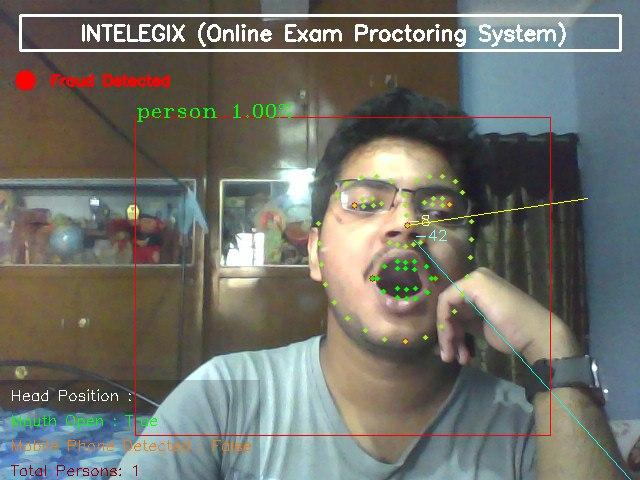
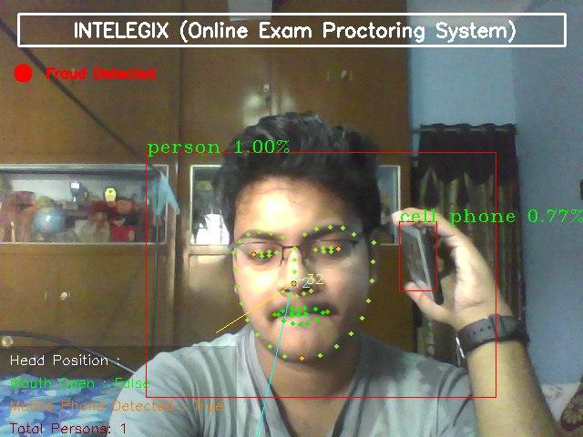

# AI ONLINE EXAM PROCTORING

Project to create an automated proctoring system where the user can be monitored automatically through the webcam. The project has Computer Vision and ML-based functionalities to monitor a user and detect fraud, in case the application detects fraud it sends a warning/image to a Telegram/Whats App/Email through REST API.

### Prerequisites

For vision:
```
opencv-python==4.4.0.44
requests==2.24.0
PyAutoGUI==0.9.52
configparser==5.0.1
tensorflow==2.3.1
scikit-learn==0.23.2
nltk==3.5
SpeechRecognition==3.8.1
wget==3.2
```

## MASK DETECTION RESULT

<p align="center">
    
    <br>
    <sup><a href="https://github.com/raj713335/AI_ONLINE_EXAM_PROCTORING" target="_blank"><strong>AI ONLINE EXAM PROCTORING</strong></a></sup>
</p>


## Vision

It has four vision based functionalities right now:

1. Find if the candidate opens his mouth by recording the distance between lips at starting.
2. Instance segmentation to count number of people and report if no one or more than one person detected.
3. Find and report any instances of mobile phones.
4. Head pose estimation to find where the person is looking.


### Face detection

Earlier, Dlib's frontal face HOG detector was used to find faces. However, it did not give very good results. In face_detection different face detection models are compared and OpenCV's DNN module provides best result and the results are present in
It is implemented in `AI_PROCTORING.py` and is used for tracking eyes, mouth opening detection and head pose estimation.


### Facial Landmarks
Earlier, Dlib's facial landmarks model was used but it did not give good results when face was at an angle.

It is implemented in `AI_PROCTORING.py` and is used for tracking eyes, mouth opening detection, and head pose estimation.

### when there is no detection of fraud 


### Mouth Opening Detection
`AI_PROCTORING.py` is used to check if the candidate opens his/her mouth during the exam after recording it initially. It's explanation can be found in the main article, however, it is using dlib which can be easily changed to the new models.



### Person counting and mobile phone detection
`AI_PROCTORING.py` is for counting persons and detecting mobile phones. YOLOv3 is used in Tensorflow.




### If no person is detected in the frame


### Head pose estimation
`AI_PROCTORING.py` is used for finding where the head is facing. 


### FPS obtained

Functionality | On Intel i5
--- | ---
Mouth Detection | 7.2
Person and Phone Detection | 1.3
Head Pose Estimation | 8.5


