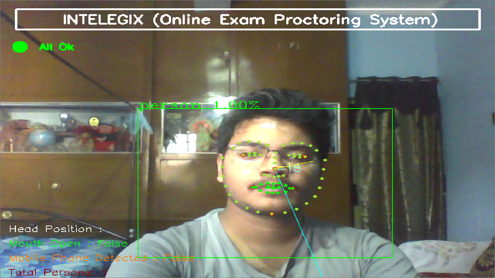
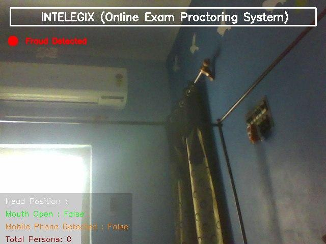
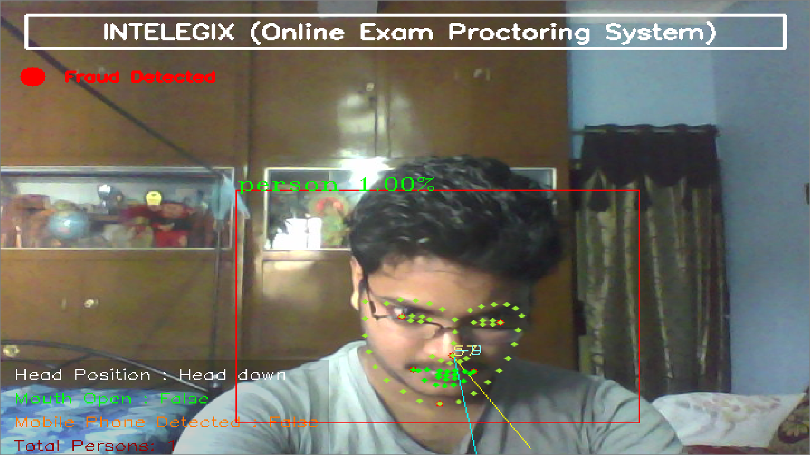

# INTELEGIX (hack-ed-v10) Theme Intelligent Video Monitoring


A cross platform desktop application for monitoring and analyzing from a live camera feed or videos files to analyse data for

    1.  Classroom environment: How much students are participating in discussions, how is the discipline in the class etc
      
    2.  Corridor environment (outside classroom): Gents entering ladies washrooms and vice versa.
    
    3.  Hostel environment: Students outside dorms after designated timings, Unauthorized entry in campus etc

    4.  School Buses: Driver drowsy, driver talking on cellphone while driving, driver/conductor smoking in the bus etc
    
    5.  Online Exam : To monitor if the student is participating in any malpractices like using cell phones , talking,
        looking here and there etc.
    
After Videos are analysed using Machine Learning , it saves and sends data via Email,Whats App Bots,and Telegram Bots via API Tokens/keys.

This Application was created for Participating in HackerEarth Challenges hack-ed-v10 for K12 Techno Services.
 <p align="center">
    
    <br>
    <sup><a href="https://www.hackerearth.com/challenges/hackathon/hack-ed-v10/" target="_blank">hack-ed-v10</a></sup>
</p>

## THEME Intelligent Video Monitoring

Develop a layer of analysis over video feed. It should be focussed around applications in a school or a classroom environment.

    Minimum Requirements
    
    Develop a layer of analysis over video feed. It should be focussed around applications in a school or a classroom environment.

    Some examples-
    
        1.  Classroom environment: How much students are participating in discussions, how is the discipline in the class etc
        2.  School environment (outside classroom): Discipline in corridors and open areas, Gents entering ladies washrooms and vice versa, Detecting vandalism, Detecting medical emergencies etc
        3.  Hostel environment: Students outside dorms after designated timings, Unauthorized entry in campus etc
        4.  School Buses: Driver drowsy, driver talking on cellphone while driving, driver/conductor smoking in the bus etc
    
    The analysis can be on live feed triggering alerts in real-time or on recorded feed for consolidated analysis
    
    On Front End:
    
        Build an interface to upload a video for analysis
        Display results in a presentable manner for the uploaded video
        Display results of previously uploaded videos
        Send Data to Telegram/Whats App through API
    
    On Back end:   
    
        Build the algorithm to analyze the video and identify the event(s) of your choice
        Store the clip showing the event occurrence and capture the relevant details
        The data sharing between Frontend and Backend should be in JSON format rendered over REST APIs.
        Zip all your Source Code, Screenshots, Deployment Instructions/Readme and Upload
    
    
# INTELEGIX WORKING SAMPLE

## AI ONLINE EXAM MONITORING

## DETECTION RESULT

<p align="center">
    
    <br>
    <sup><a href="https://github.com/raj713335/AI_ONLINE_EXAM_PROCTORING" target="_blank"><strong>AI ONLINE EXAM PROCTORING</strong></a></sup>
</p>


Project to create an automated proctoring system where the user can be monitored automatically through the webcam. The project has Computer Vision and ML-based functionalities to monitor a user and detect fraud, in case the application detects fraud it sends a warning/image to a Telegram/Whats App/Email through REST API.


### Vision

It has four vision based functionalities right now:

    1. Find if the candidate opens his mouth by recording the distance between lips at starting.
    2. Instance segmentation to count number of people and report if no one or more than one person detected.
    3. Find and report any instances of mobile phones.
    4. Head pose estimation to find where the person is looking.


### Face detection

Earlier, Dlib's frontal face HOG detector was used to find faces. However, it did not give very good results. In face_detection different face detection models are compared and OpenCV's DNN module provides best result and the results are present in
It is implemented in `AI_PROCTORING.py` and is used for tracking eyes, mouth opening detection and head pose estimation.


### Facial Landmarks
Earlier, Dlib's facial landmarks model was used but it did not give good results when face was at an angle.

It is implemented in `AI_PROCTORING.py` and is used for tracking eyes, mouth opening detection, and head pose estimation.

- when there is no detection of fraud 


- Mouth Opening Detection
`AI_PROCTORING.py` is used to check if the candidate opens his/her mouth during the exam after recording it initially. It's explanation can be found in the main article, however, it is using dlib which can be easily changed to the new models.


- Person counting and mobile phone detection
`AI_PROCTORING.py` is for counting persons and detecting mobile phones. YOLOv3 is used in Tensorflow.


- If no person is detected in the frame


- Head pose estimation
`AI_PROCTORING.py` is used for finding where the head is facing. 




#### FPS obtained

Functionality | On Intel i5
--- | ---
Mouth Detection | 7.2
Person and Phone Detection | 1.3
Head Pose Estimation | 8.5


# Getting Started

- Clone the repo and cd into the directory
```sh
$ git clone https://github.com/raj713335/INTELEGIX.git
$ cd INTELEGIX
```
- Delete the current Data folder inside INTELEGIX folder and then download the Data.zip from the given url and extract and copy the data folder in INTELEGIX folder

```sh
$ wget https://drive.google.com/uc?id=1YnA1wmaBoD3MPLEUWmZoUsvCsySB5Ng2&export=download
```

- Install Python and its required Packages like tensorflow etc.

```sh
$ pip install EasyTkinter==1.1.0
$ pip install Pillow==8.0.1
$ pip install opencv-python==4.4.0.46
$ pip install requests==2.25.0
$ pip install configparser==5.0.1
$ pip install PyAutoGUI==0.9.52
$ pip install tensorflow==2.3.1
$ pip install scikit-learn==0.23.2
$ pip install wget==3.2
$ pip install pygame==2.0.0
$ pip install dlib==19.21.0
$ pip install imutils==0.5.3
$ pip install deepface==0.0.40
$ pip install keras==2.4.3
$ pip install cvlib==0.2.5
$ pip install pyinstaller 
```

- Run the app

```sh
$ python home.py
```


## Packaging the Application for Creating a Execulatle exe File that can run in Windows,Linus,or Mac OS

You can pass any valid `pyinstaller` flag in the following command to further customize the way your app is built.
for reference read the pyinstaller documentation <a href="https://pyinstaller.readthedocs.io/en/stable/usage.html">here.</a>

```sh
$ pyinstaller -i "favicon.ico" --onefile -w --hiddenimport=EasyTkinter --hiddenimport=Pillow  --hiddenimport=opencv-python --hiddenimport=requests--hiddenimport=Configparser --hiddenimport=PyAutoGUI --hiddenimport=numpy --hiddenimport=pandas --hiddenimport=urllib3 --hiddenimport=tensorflow --hiddenimport=scikit-learn --hiddenimport=wget --hiddenimport=pygame --hiddenimport=dlib --hiddenimport=imutils --hiddenimport=deepface --hiddenimport=keras --hiddenimport=cvlib --name INTELEGIX home.py
```
